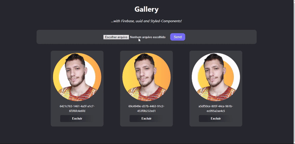

# :framed_picture: Galeria da Fotos
Projeto desenvolvido durante aulas práticas de ReactJS do curso da [B7Web](https://b7web.com.br/fullstack/?ref=I24108426I&gclid=Cj0KCQiAveebBhD_ARIsAFaAvrF6-0Pw1qPxDOdtvTaBsTQJG_93ZtMC1SlajUx3ySXg3McgRB3l2R4aAhEVEALw_wcB).

Adicionei `Tema Escuro` e `Estilizações` póprias.

## :electric_plug: Tecnologias utilizadas
* React JS
* Styled-Components
* TypeScript
* Firebase

## :desktop_computer: Hospedagem

O projeto foi hospedado na Vercel. [Clique aqui para acessar](reactjs-gallery-sooty.vercel.app
) 
(Na hospedagem não há fotos devido a privacidade dos dados do Firebase. Segue GIF mostrando o funcionamento)

## :atom: Projeto criado com [Create React App](https://github.com/facebook/create-react-app).

## Scripts

### `npm install`

Instalar dependências

### `npm start`

Rodar o projeto